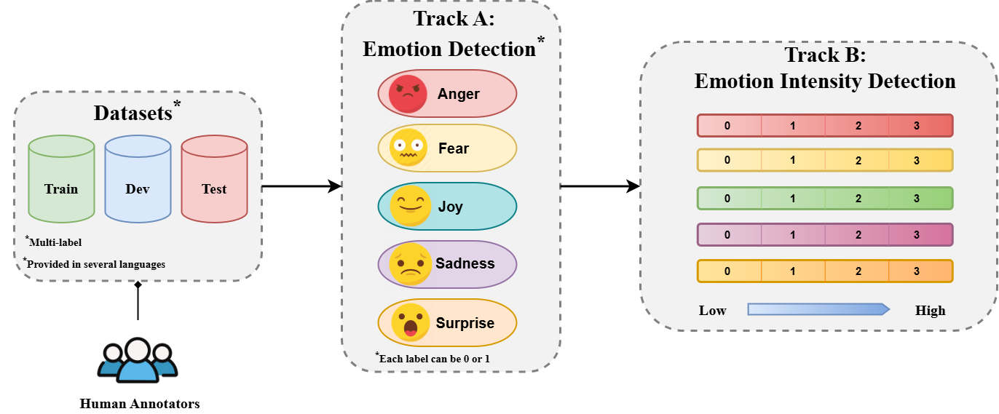
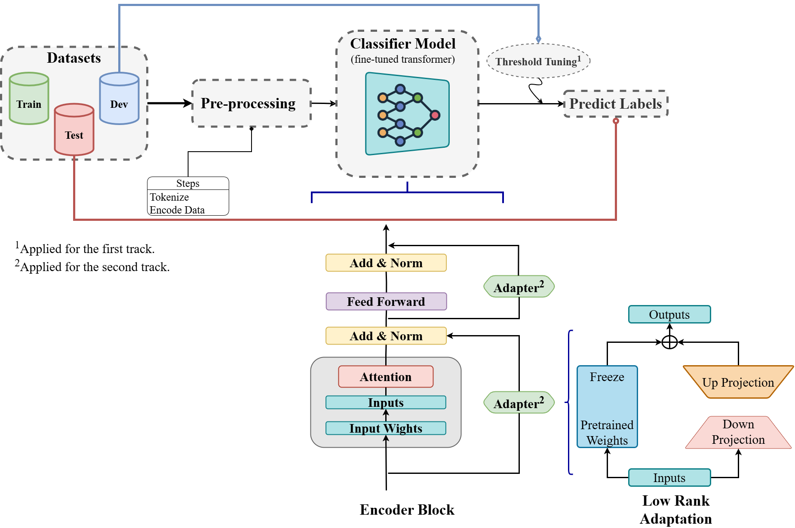

# Emotion Detection in Low-Resource Languages with Fine-Tuned Transformers and LoRA

## Overview

This repository contains the code for our participation in **SemEval-2025 Task 11: Bridging the Gap in Text-Based Emotion Detection**, covering:

- **Track A** — Multi-label emotion detection (joy, sadness, fear, anger, surprise, disgust)  
- **Track B** — Emotion intensity prediction (ordinal scale 0–3)
<p align="center">
  
</p>
We achieved **9th place** in the Arabic Algerian track (ARQ) among 40 competing teams.

Our approach combines **transformer-based models** with **Parameter-Efficient Fine-Tuning (PEFT)** via **LoRA (Low-Rank Adaptation)** to handle the challenges of low-resource language settings.

---

## Languages

| Track | Languages |
|-------|-----------|
| Track A | Afrikaans (AFR), Arabic Algerian (ARQ), Hindi (HIN), Swedish (SWE) |
| Track B | Russian (RUS), Romanian (RON) |

---

## Models Used

**Track A**
- XLM-RoBERTa-Base
- T-XLM-RoBERTa
- BERT-Multilingual
- DiziBERT-Sent. (Arabic Algerian)
- BERT-Base-Swedish-Cased-Sent.

**Track B**
- XLM-RoBERTa
- T-XLM-RoBERTa
- BERT-Multilingual

---

## Results

### Track A (Micro F1)

| Language | Best Model | Micro F1 |
|----------|-----------|----------|
| Afrikaans | T-XLM-RoBERTa | 0.54 |
| Hindi | XLM-RoBERTa-Base | 0.84 |
| Arabic Algerian | DiziBERT-Sent. | 0.58 |
| Swedish | BERT-Base-Swedish-Cased-Sent. | 0.72 |

### Track B (Pearson Correlation)

| Language | Best Model | Pearson Corr. |
|----------|-----------|---------------|
| Russian | XLM-RoBERTa | 0.83 |
| Romanian | XLM-RoBERTa | 0.57 |

---

## Methodology

### Track A
- Fine-tuned pretrained transformer models for multi-label classification
- Sigmoid-based output with threshold tuning to maximize F1 score
- Initial threshold: 0.3, then tuned on the dev set

### Track B
- LoRA applied to transformer layers for parameter-efficient adaptation
- **Loss function:** Mean Squared Error (MSE)
- **Post-processing:** Floor clipping to enforce predictions in [0, 3]
- **Evaluation metric:** Pearson Correlation

<p align="center">
  
</p>

---

## Repository Structure
```
├── trackA/      # Multi-label emotion detection notebooks
├── trackB/      # Emotion intensity prediction notebooks
└── README.md
```

---

## Citation

If you use this code, please cite our paper:
```bibtex
@inproceedings{naebzadeh-askari-2025-ginger,
  title     = {GinGer at SemEval-2025 Task 11: Leveraging Fine-Tuned Transformer Models and LoRA for Sentiment Analysis in Low-Resource Languages},
  author    = {Naebzadeh, Aylin and Askari, Fatemeh},
  booktitle = {Proceedings of the 19th International Workshop on Semantic Evaluation (SemEval-2025)},
  pages     = {2028--2037},
  year      = {2025}
}
```

---

## Authors

- **Aylin Naebzadeh** — Iran University of Science and Technology · [aylin.naebzadeh@gmail.com](mailto:aylin.naebzadeh@gmail.com)
- **Fatemeh Askari** — Sharif University of Technology · [fatemeh.askari@ce.sharif.edu](mailto:fatemeh.askari@ce.sharif.edu)
